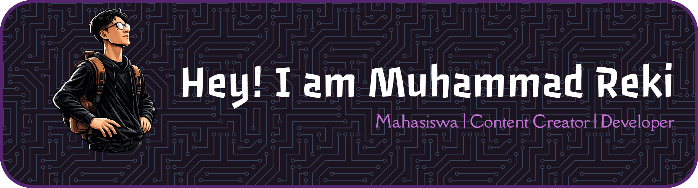
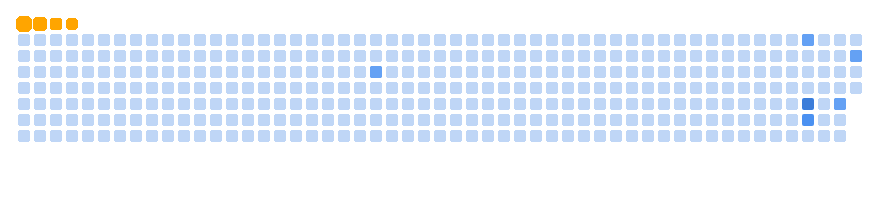

<!-- Banner -->

# 👋 Halo, Kenalin Gw Reki

🎓 Saya Mahasiswa Teknologi Reyakasa Komputer  
💻 Web Developer (Frontend & Backend)  
🚀 Fokus mengembangkan aplikasi web yang interaktif, modern, scalable  

  

## 🧑‍💻 Tentang Saya
Saya adalah pribadi yang cenderung pendiam dan introvert, lebih nyaman dengan mendengarkan musik dan bermain game serta ngoding. Saya memiliki minat besar dalam pengembangan web dan senang menghabiskan waktu untuk ngoding, mengeksplorasi teknologi baru, dan membuat proyek yang berkualitas.

## ⚙️ Keahlian dan Teknologi

## 📫 Contact with me

  

##### My Github Statistics

##### Play Game With Me

  

#
⭐ Terima kasih sudah berkunjung ke profil GitHub saya
